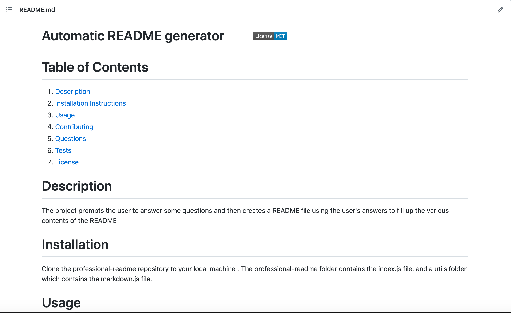
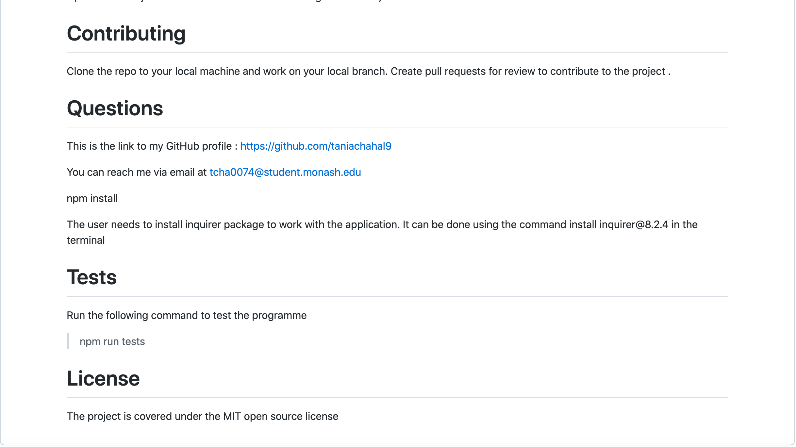

# Professional-README-generator

## Description

The following project creates a professional README.md file for a project based on responses of the user. The application is run using command-line and the user is prompted some questions about the project and the repository. The responses of the user are then used to generate a professionsal README.md file for the project. 

## Installation

Clone the Professional-README-generator repository to your local machine. The Professional-README-generator folder contains a Develop folder which index.js file, and the utils folder. The utils folder contains the markdown.js file. 

## Usage

The user needs to run the command npm init in the terminal to install the required dependencies for the application followed by the command npm install inquirer@8.2.4. The user can then run the index.js file using the command node index.js which will then present the user with questions to respond to. Once the user has answered all the questions a message is displayed in the terminal and the README.md file is generated in the Develop folder  

## License

Please refer to the license in the repository

## Walk-through Video link 

